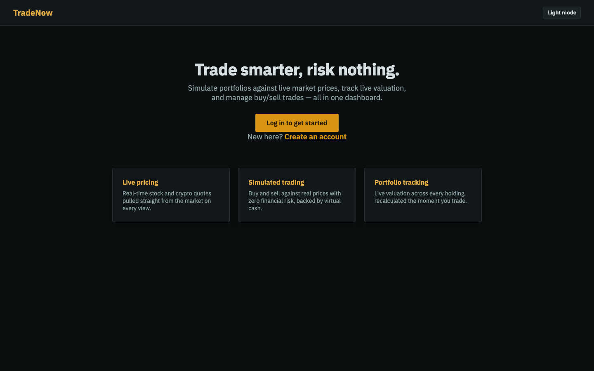

# Trading Simulator

A cloud-native portfolio trading simulator: track simulated portfolios, trade against live
market prices, backtest a trade against a historical date, get alerted when a portfolio swings,
and export a PDF statement — built end-to-end on AWS managed services.



**[Live app](http://tradenow-static-assets-561641367291.s3-website-us-east-1.amazonaws.com)**
— sign up and try it; it's simulated money, no real trades.

## Features

- **Live trading** — buy/sell against real-time quotes from Twelve Data, with a seeded $100k
  virtual cash balance per portfolio.
- **Backtesting** — click a point on the price chart to buy/sell at that historical price, then
  click a second point to see the win/loss.
- **Market trend reports** — a Spark job on EMR computes moving averages and trend
  classification from historical data, rendered as a table and chart.
- **Portfolio alerts** — a scheduled check flags any portfolio that's moved ±5% from baseline.
- **PDF statements** — one-click export of holdings, valuation, and transaction history.
- **Auth0 login**, including a custom sign-up flow, with a bearer-token session (no cookies —
  the frontend and API live on different domains).
- Light/dark theme, persisted per device.

## Architecture


- **Flask API** on Elastic Beanstalk, fronted by API Gateway.
- **PostgreSQL (RDS)** for users, portfolios, holdings, transactions, and alerts — see the
  [entity-relationship diagram](doc_images/er_diagram.png).
- **EMR (Spark)** computes market trends from historical data landed in S3; a Lambda function
  launches the cluster automatically on new data, and it self-terminates when done.
- **Lambda on a schedule** checks every portfolio against its baseline every 15 minutes and
  writes an alert if it's moved enough.
- **ECS (Fargate)**, behind an Application Load Balancer, renders PDF statements as a
  stateless service — the backend posts data to it, the browser never calls it directly.
- **Auth0** for authentication; the backend issues its own signed bearer token rather than
  relying on a cross-domain session cookie.

An editable version of the diagram is at `doc_images/architecture_diagram.drawio` (import into
Lucidchart via File → Import File).

## Tech stack

Python / Flask · PostgreSQL · Vanilla JS (no framework) · PySpark · AWS: Elastic Beanstalk,
API Gateway, Lambda, EMR, ECS/Fargate, RDS, S3, ALB · Auth0 · Twelve Data API

## Running locally

Requires Python 3.12+, a PostgreSQL database, an Auth0 application, and a
[Twelve Data](https://twelvedata.com) API key.

```bash
# Backend
cd backend
python3 -m venv .venv && .venv/bin/pip install -r requirements.txt
cp .env.example .env   # fill in DATABASE_URL, AUTH0_*, MARKET_API_KEY
.venv/bin/python app.py                       # http://localhost:5000

# PDF service (separate terminal)
cd pdf-service
python3 -m venv .venv && .venv/bin/pip install -r requirements.txt
.venv/bin/python app.py                       # http://localhost:8080

# Frontend (separate terminal)
cd frontend
python3 -m http.server 5500                   # http://localhost:5500
```

`frontend/js/api.js` points `API_BASE` at the deployed API by default — edit it to
`http://localhost:5000` to hit your local backend instead.

`emr/moving_average_job.py` and `lambda/*/lambda_function.py` aren't meant to run standalone —
they're invoked by EMR and Lambda in AWS respectively.

## Origin

Built solo as a cloud-architecture project for a university cloud computing course, scoped so
that every AWS service in the stack is a real, load-bearing part of the app rather than there
for its own sake.
