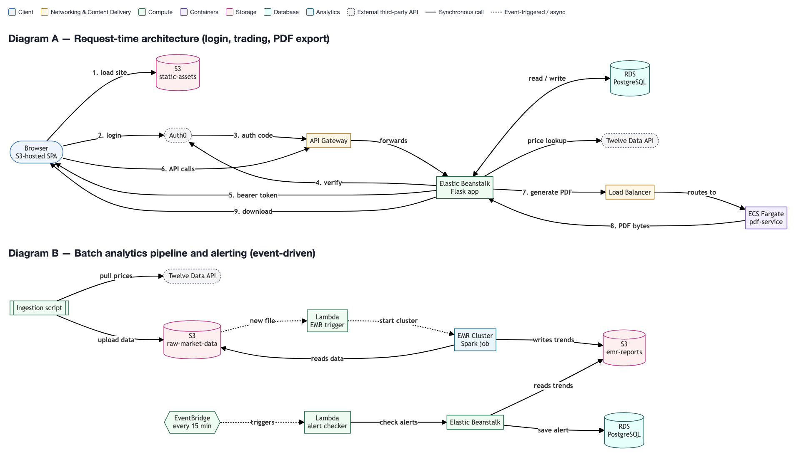

# Trading Simulator

A cloud-native portfolio trading simulator: track simulated portfolios, trade against live
market prices, backtest a trade against a historical date, get alerted when a portfolio swings,
and export a PDF statement.


**[Live app](#)** — sign up and try it; it's simulated money, no real trades.

## Features

- **Live trading** — buy/sell against real-time quotes from Twelve Data, with a seeded $100k
  virtual cash balance per portfolio.
- **Backtesting** — click a point on the price chart to buy/sell at that historical price, then
  click a second point to see the win/loss.
- **Market trend reports** — moving averages and trend classification computed from historical
  data on a schedule, rendered as a table and chart.
- **Portfolio alerts** — a scheduled check flags any portfolio that's moved ±5% from baseline.
- **PDF statements** — one-click export of holdings, valuation, and transaction history.
- **Auth0 login**, including a custom sign-up flow, with a bearer-token session (no cookies —
  the frontend and API live on different domains).
- Light/dark theme, persisted per device.

## Architecture



- **Flask API** on Render.
- **PostgreSQL (Supabase)** for users, portfolios, holdings, transactions, alerts, and market
  trends — see the [entity-relationship diagram](doc_images/er_diagram.png) (alerts/holdings/
  transactions schema is unchanged from the original design).
- **Market trends** — `backend/compute_trends.py` fetches historical prices and computes
  7-day/30-day moving averages with pandas, run on a schedule via GitHub Actions.
- **Alert checks** — a GitHub Actions schedule hits the backend's `/internal/check-alerts`
  endpoint every 15 minutes.
- **PDF statements** — rendered in-process (`backend/pdf_export.py`, reportlab).
- **Auth0** for authentication; the backend issues its own signed bearer token rather than
  relying on a cross-domain session cookie.
- **Frontend** — a static single-page app with no build step, served from GitHub Pages.

The diagram above and `doc_images/architecture_diagram.drawio` (import into Lucidchart via
File → Import File) reflect the *original* deployment this project shipped with — AWS Elastic
Beanstalk, API Gateway, Lambda, EMR/Spark, and ECS/Fargate, built for a university cloud
computing course. The functional pieces (moving-average computation, scheduled alert checks,
PDF rendering) are unchanged; only where they run has moved, onto a free-tier stack that stays
live without a sandboxed AWS account behind it. See **Origin** below.

## Tech stack

Python / Flask · PostgreSQL (Supabase) · Vanilla JS (no framework) · pandas · Render ·
GitHub Actions · GitHub Pages · Auth0 · Twelve Data API

## Running locally

Requires Python 3.12+, a PostgreSQL database (e.g. a free Supabase or Neon project), an Auth0
application, and a [Twelve Data](https://twelvedata.com) API key.

```bash
cd backend
python3 -m venv .venv && .venv/bin/pip install -r requirements.txt
cp .env.example .env   # fill in DATABASE_URL, AUTH0_*, MARKET_API_KEY
psql "$DATABASE_URL" -f ../data/schema.sql     # create the tables
.venv/bin/python app.py                        # http://localhost:5000
```

```bash
cd frontend
python3 -m http.server 5500                    # http://localhost:5500
```

`frontend/js/api.js` points `API_BASE` at the deployed API by default — edit it to
`http://localhost:5000` to hit your local backend instead.

To populate market trend data locally:
```bash
cd backend
.venv/bin/python compute_trends.py
```

## Origin

Built solo as a cloud-architecture project for a university cloud computing course, originally
deployed end-to-end on AWS (Elastic Beanstalk, API Gateway, Lambda, EMR, ECS/Fargate, RDS, S3)
so that every service used was a real, load-bearing part of the app. Re-hosted on a free-tier
stack once that AWS sandbox account's access ended, with two functional pieces simplified along
the way: the EMR/Spark trend job became a scheduled pandas script, and the ECS PDF-rendering
microservice was folded directly into the backend. Same logic, lighter infrastructure.
